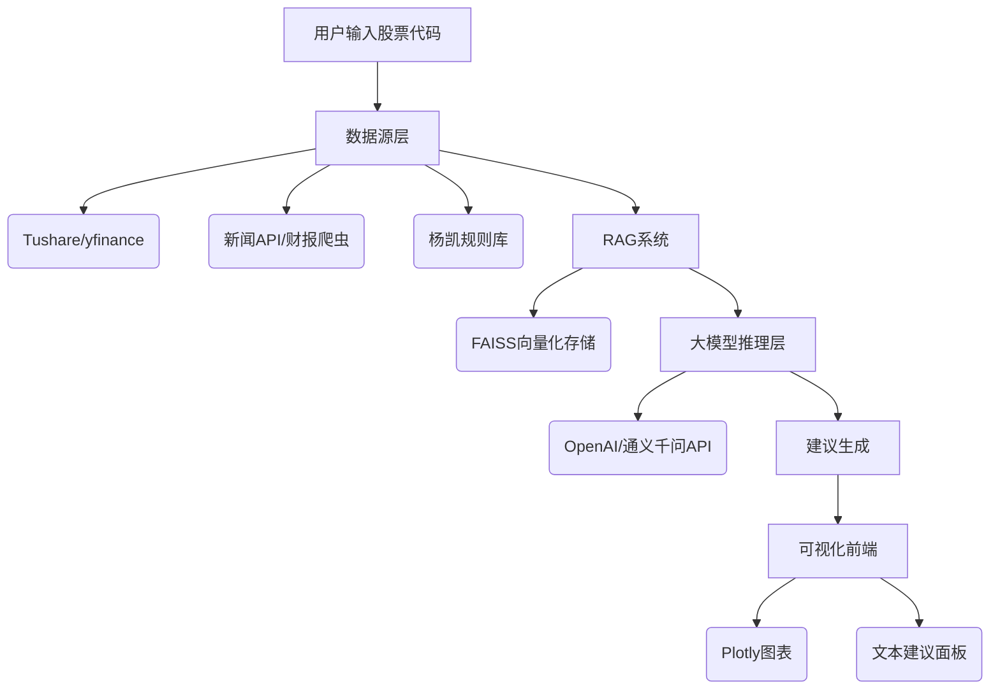

以下是一个基于杨凯方法论的 **股票分析产品初步Demo方案**，整合了多数据源、RAG技术、大模型生成建议等核心功能，可快速搭建验证：


## **杨凯老师交易方法：
【核心策略框架】
1.一、多头持股条件（同时满足以下所有）：均线系统
√ 股价连续4个交易日收盘价 > 20日均线
2.√ 20日均线呈上升趋势量能系统
√ 连续3日成交量 > 120日均量线
3.√ 量价齐升（价格上涨伴随成交量放大）趋势判定
→ 判定为"上涨浪"运行结构
→ 建议操作：继续持有/择机加仓二、空头观望条件（满足任一）：
1.均线系统
2.× 股价跌破20日均线量能系统
3.× 成交量持续低于120日均量线趋势判定
→ 判定为"下跌浪"运行结构
→ 建议操作：减仓/离场观望【技术指标参数】
●时间窗口设置：趋势判定周期：4个连续交易日
●量能验证周期：3个连续交易日
●基准均线：20日价格均线
●基准均量：120日成交量均线
【策略逻辑】
通过量价时空四维验证：
① 空间维度：价格站稳中期均线
② 时间维度：连续交易日验证有效性
③ 量能维度：资金活跃度达标
④ 趋势维度：形成明确上升浪结构

---

# **杨凯方法论股票分析系统 Demo 方案**

---

## **1. 产品目标**
- **核心功能**：  
  输入股票代码（如001298），自动分析是否符合杨凯方法论的上涨/下跌趋势规则，并结合大模型生成综合建议。
- **技术特点**：  
  - 多数据源整合（股票数据+新闻+财报）。  
  - RAG技术增强模型检索能力。  
  - 交互式可视化展示关键指标。

---

## **2. 核心功能模块**
### **2.1 数据获取与预处理**
- **数据源**：
  - **股票数据**：使用 `yfinance`（美股）或 `Tushare`（A股）获取价格、成交量。
  - **新闻/财报**：通过 `NewsAPI` 或爬虫抓取相关公告与新闻。
- **预处理**：
  ```python
  # 示例代码：获取股票数据
  import yfinance as yf
  stock = yf.Ticker("001298.SZ")
  df = stock.history(period="90d")
  ```

### **2.2 杨凯方法论规则验证**
- **计算指标**：
  - 20日均线（`ma20`）、120日均量线（`vol120`）。
  - 近4日收盘价是否连续高于`ma20`，近3日成交量是否高于`vol120`。
- **规则代码片段**：
  ```python
  def check_rules(data):
      up_trend = (data['Close'] > data['ma20']).rolling(4).min().iloc[-1] == 1
      volume_active = (data['Volume'] > data['vol120']).rolling(3).min().iloc[-1] == 1
      return up_trend, volume_active
  ```

### **2.3 RAG增强的大模型建议**
- **RAG流程**：
  1. 将杨凯规则、股票数据、新闻/财报分块并编码成向量。
  2. 使用 `FAISS` 构建索引，输入股票代码时检索相关数据。
  3. 调用大模型（如OpenAI的GPT或阿里云通义千问）生成建议。
- **大模型输入示例**：
  ```text
  根据杨凯方法论，分析股票001298的当前状态：
  - 近4日收盘价在20日均线上方：{up_trend}
  - 近3日成交量在120日均量线上方：{volume_active}
  - 最新新闻：[RAG检索到的新闻摘要]
  请生成操作建议。
  ```

### **2.4 可视化展示**
- **图表**：用 `Plotly` 展示价格/均线、成交量/均量线趋势。
- **建议面板**：显示大模型生成的文本建议及风险提示。
- **示例代码（Plotly）**：
  ```python
  fig = go.Figure()
  fig.add_trace(go.Scatter(x=data.index, y=data['Close'], name='收盘价'))
  fig.add_trace(go.Scatter(x=data.index, y=data['ma20'], name='20日均线'))
  fig.show()
  ```

---

## **3. 技术架构**


---

## **4. 实现步骤**
1. **环境搭建**：
   ```bash
   pip install yfinance pandas plotly langchain faiss-cpu openai
   ```
2. **数据准备**：
   - 下载股票数据并计算指标。
   - 爬取新闻/财报并分块存储。
3. **RAG系统初始化**：
   ```python
   from langchain.vectorstores import FAISS
   from langchain.embeddings import OpenAIEmbeddings

   # 创建向量数据库
   embeddings = OpenAIEmbeddings()
   vector_db = FAISS.from_texts(texts, embeddings)
   ```
4. **生成建议**：
   ```python
   query = "分析股票001298是否符合杨凯方法论"
   docs = vector_db.similarity_search(query)
   advice = model.generate(text=query + "\n" + "\n".join([d.page_content for d in docs]))
   ```

---

## **5. 示例界面**
### **5.1 输入界面**
```text
请输入股票代码：001298
```

### **5.2 输出界面**
- **图表展示**：
  
  

- **建议文本**：
  ```text
  根据杨凯方法论分析：
  - 当前处于上涨浪运行（连续4日高于20日均线）。
  - 成交量活跃（连续3日高于120日均量线）。
  - 最新新闻：财报显示营收同比增长15%，行业政策利好。
  **建议**：继续持股，但需关注市场情绪波动风险。
  ```

---

## **6. 扩展性与优势**
- **扩展方向**：
  - 增加更多技术指标（如MACD、RSI）。
  - 集成实时数据推送（如WebSocket）。
  - 添加回测功能验证策略有效性。
- **核心优势**：
  - **精准规则验证**：严格遵循杨凯方法论的量化条件。
  - **多源数据整合**：结合技术面、基本面与市场情绪。
  - **可视化交互**：直观展示趋势与建议逻辑。

---

## **7. 代码仓库示例**
```markdown
├── data/               # 数据存储目录
│   ├── stock_data.csv  # 股票数据
│   └── news_data.json  # 新闻/财报数据
├── models/             # 向量数据库与模型配置
│   └── faiss_index.pkl # FAISS索引文件
├── app.py              # 主程序（含RAG+大模型调用）
└── visualize.py        # 可视化模块
```

---

通过此方案，用户可快速验证杨凯方法论的逻辑，并通过大模型生成更人性化的分析建议，为后续产品迭代提供基础架构。